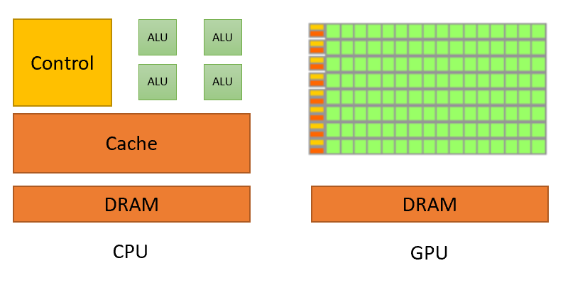
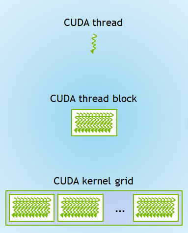

# CUDA 编程入门

Introduction to CUDA Programming: From Correctness to Performance

本文改编自北京大学超算队CUDA教程讲义，原作者为interestingLSY。
 
# Overview

本文将从 GPU 的结构与 CUDA 的基本概念出发，带领大家写出自己的第一个正确的 CUDA 程序，并展示一些基本的优化技巧，带领大家优化自己的 CUDA 程序（正如标题所示，From Correctness to Performamce）。

本文分为三部分：Part 0 简要介绍了为什么 GPU 能在许多任务上取得千倍的加速比；Part 1 介绍了 GPU 编程的基本概念，以及如何写出第一个 CUDA 程序；Part 2 则是一些基本的优化技巧。示例代码、课后作业所在的 git 仓库位于 https://github.com/interestingLSY/CUDA-From-Correctness-To-Performance-Code

> Aside | 拓展内容：本文中标注了 "Aside" 的内容为拓展内容，我们认为他们比较有趣，但与本文主线关联不大。

# Introduction

## Why GPU?

使用过 `PyTorch`等机器学习框架的同学应该体会过，同一个神经网络在 GPU 上的运行速度可能是 CPU 的数十倍甚至数百倍。因为GPU 底层的硬件设计它特别擅长于执行逻辑简单但是并行程度极高的计算任务。这样的任务与机器学习的负责高度重合，包括：

- 向量加法
- 矩阵乘法
- 有限元解偏微分方程
- 求出一个向量中所有元素的和
- ...

GPU 能在此类任务上取得如此高的性能提升，主要是在设计哲学上与 CPU 有显著不同。CPU 的设计目标是让单个线程执行得更快，降低串行任务完成的延迟 (latency)，所以CPU 把大量的晶体管耗费在了分支预测、乱序执行等控制单元上，分配给运算单元（ALU 等）的晶体管较少。

而 GPU 的设计哲学是吞吐量（throughput）比延迟更加重要。也就是说，GPU 的设计目标是让大量的数据可以同时被处理。GPU 使用大量的晶体管来堆砌大量的运算单元，通过同时让许多运算单元共享同一个控制单元，以节约晶体管。对于分支预测、乱序执行等控制单元，GPU 采用了“不预测、不乱序”的策略。这样的设计使得 GPU 在执行逻辑简单、并行度高的任务时能够发挥出其最大的性能。虽然 GPU 上单条数据处理的时间可能比用 CPU 更长，但 GPU 单位时间内处理完成的数据要要多得多。

我们打个比方：如果我们现在想证明一个复杂的数学命题，那么是一位陈景润解得快，还是 100 名大一学生解得快？大概率是前者，因为陈景润先生有着深厚的功底与丰富的经验，并且“证明命题”这一过程很难并行。

但如果我们现在想要计算 10000 道 100 以内的乘除法呢？那么大概率是 100 名大一学生算得快。因为，虽然一名大一学生计算一道 100 以内的乘除法的速度比不上陈景润先生计算一道 100 以内的乘除法的速度，但100 名大一学生一起工作，速度一定会比一位陈景润先生要快。

CPU 与 GPU 的区别就好像上文中的一位陈景润先生与 100 名大一学生的区别。CPU 适合执行逻辑复杂、并行度低的任务，GPU 适合执行逻辑简单、并行度高的任务。以向量加法为例，它逻辑很简单（只需要把两个向量的对应位置加起来即可），且并行度极高（可以同时计算输出向量每个位置上的结果）。如果使用 CPU，那么我需要依次计算输出向量每个位置的结果；但如果使用 GPU，我可以同时计算输出向量每个位置的结果，进而大大提高了速度。



*Image source: https://developer.nvidia.com/blog/cuda-refresher-reviewing-the-origins-of-gpu-computing/*

> Aside | Intel Xeon Phi: CPU 是”少量大核心“，适合执行串行任务；GPU 是”大量小核心“，适合执行逻辑简单、并行度大的任务；那么”中量中核心“会有怎样的效果呢？感兴趣的同学可以搜索一下 Intel Xeon Phi。

这里有一个形象的解释 CPU 与 GPU 工作原理区别的视频：[Link](https://www.bilibili.com/video/BV1ry4y1y7KZ)。

## 为什么 GPU 会这样设计

可是... GPU，Graphic Processing Unit，“显卡”，原本不是用来处理图像的吗？为什么它会这么设计？

我们先来考虑 3D 游戏画面的渲染管线。我们可以将这个管线分为三个部分：Vertex Mapping, Fragment Generation 与 Fragment Merging。

在很久之前，每一家 GPU（当时还叫“图形加速卡”）的厂商的做法都是：让一部分电路专门负责 Vertex Mapping，一部分电路专门负责 Fragment Generation，一部分电路专门负责 Fragment Merging。但是，这样做有一个问题：每一款游戏对不同的处理步骤的负载是不同的，比如游戏 A 可能给 Vertex Mapping 单元的负载较高，导致其成为瓶颈，同时其他两部分电路有空闲；游戏 B 可能给 Fragment Generation 的负载较高，导致其成为瓶颈。

在 2006 年，NVIDIA 推翻了传统而设计，发布了一个革命性的 GPU 架构 - Tesla。在 Tesla 架构中，没有了专门负责处理某一个步骤的硬件单元，取而代之的则是 Stream Multiprocessor (SM) 。每个 SM 都像一个小型 CPU 一样，可以执行其支持的指令集中的任何程序。这也就代表着，每一个 SM 都有能力执行渲染管线中的每个部分。这种设计避免了某一个步骤成为瓶颈而其他步骤的运算单元闲置的情况：我只需要根据不同的游戏负载，为每个步骤分配一定数量的 SM 即可。

同时，NVIDIA 发现，Tesla 架构不仅可以执行图像渲染方面的计算，其在通用计算方面也很有潜力（毕竟，SM 可以执行任何指令集支持的指令）。所以，Nvidia 也在同时发布了一套可以在 GPU 上执行通用计算的工具链 —— Compute Unified Device Architecture (CUDA)。从此，GPU 成为了 General-Purpose Graphics Processing Unit (GPGPU)。

> Aside: 想要深入了解 NVIDIA 的 GPU 发展史的同学可以看[这篇文章](https://fabiensanglard.net/cuda/)与 Bilibili UP 主“极客湾”的“显卡发展史系列”：[1](https://www.bilibili.com/video/BV1Hb41177JB) [2](https://www.bilibili.com/video/BV1C4411J7cR) [3](https://www.bilibili.com/video/BV1YJ411h7aY)。

## Takeaway

- CPU 的每个核心都很“大”，但核心数较少；GPU 每个核心都很“小”，但是核心数非常多。
- CPU 和 GPU 的结构决定了：CPU 适合执行串行程序，GPU 适合执行并行度极高的程序。
- GPU 之所以这样设计，与 GPU 的发展历史息息相关

# Part 1. Correctness

那么，掌握了 GPU 的基础知识，我们接下来就要开始写代码啦！

接下来我将以矩阵乘法为例，带领大家逐渐编写一个正确性无误且性能勉强过关的矩阵乘法。

> Aside | cuBLAS：作为一个十分常用的操作，市面上已经有很多成熟高效的矩阵乘法库，比如实现了线性代数中大部分计算的 [NVIDIA cuBLAS](https://developer.nvidia.com/cublas)。

> Aside | Tensor Core：因为矩阵乘法这个操作太普遍了，所以除了我们即将使用的 CUDA Core 外，Nvidia 还在显卡中设计了另一种计算单元 - [Tensor Core](https://www.nvidia.com/en-us/data-center/tensor-cores)。它可以以比 CUDA Core 高数十倍的速率计算矩阵乘法，且支持 AI 中常用的混合精度计算。

首先，请确认你正在使用的机器上面有 NVIDIA 的显卡，且你能调用 CUDA 编译器（一般来说，直接在命令行中输入 `nvcc` 即可）。

> Aside | CUDA C++：CUDA 使用的是经过 NVIDIA 魔改的 C++，其包含一些原生 C++ 不支持的语法，故不能使用 `g++` 等常规编译器。

## Step 0. 部署示例代码

首先，我们先部署好的示例代码。示例代码中包含一个用来对照的 CPU 上的 GEMM 实现、用来做性能测试的代码、以及 GEMM 在 GPU 上的若干种实现。

*注：GEMM 代表 GEneral Matrix Multiplication，矩阵乘法。*

先 clone [这个仓库](https://github.com/interestingLSY/CUDA-From-Correctness-To-Performance-Code)。随后使用 `make all && ./gemm_test 64 64 64` 来运行它。理想情况下它应该输出类似于这样的东西：

```plain
Benchmarking gpu_mult_block...
Warming up...
Verification passed!
Warming up (again)...
Round 0: 12 us
Round 1: 12 us
Round 2: 12 us
Round 3: 12 us
Round 4: 12 us
Round 5: 12 us
Round 6: 12 us
Round 7: 12 us
Average time usage: 12.000000 us
```

这个仓库中，`gemm_test.cc` 是主程序，其包含 `main` 函数以及与性能测试（benchmark）相关的逻辑。其他的 `gemm_XXX` 中包含了各种各样的 GEMM 的实现，比如 CPU 上的简单实现 `gemm_cpu_naive`、GPU 上的多 thread 单 block 实现 `gemm_gpu_mult_thread` 等。

你可以在编译后使用 `./gemm_test <n> <m> <k> [implementation]` 来 benchmark 所有的或特定的 GEMM 实现。其中，`n`, `m`, `k` 分别代表矩阵的三个维度（假设我们要计算 $C = A \times B$，那么 $A$ 矩阵的大小为 $n \times k$，$B$ 矩阵的大小为 $k \times m$，$C$ 矩阵的大小为 $n \times m$），`implementation` 代表你要 benchmark 的 GEMM 实现的名字（留空以 benchmark 所有的 GEMM 实现）。你可以在 `gemm_test.cc` 的开头位置找到所有的 GEMM 实现及其名字。

*注：如果你每次开始运行程序的时候，程序都要卡 $1 \sim 2$ 秒才有输出，那么可能是因为你没有开启 GPU 的 Persistent Mode。*

## Step 1. Your First CUDA Kernel

首先，我们需要掌握一个基本概念，CUDA Kernel：

CUDA 的设计思想大致是：向显卡提交一个又一个任务，每一个任务都形如“给定一个函数，与调用它的参数，请在显卡上运行这个函数”。我们一般**称这种“在显卡上运行的函数”叫做 CUDA Kernel**。仔细想想，这种设计很合理嘛！毕竟现在 GPU 是“加速器”，其仅负责加速程序中的某一些部分，其他的控制流程与计算还是要由 CPU 来做的。

所以，现在的问题就是：

- 如何定义（创建）一个 CUDA Kernel？
- 如何调用这个 CUDA Kernel？

首先是如何定义 CUDA Kernel 的问题。CUDA C++ 中有三类函数：

- `__host__`: 这类函数与正常的函数没有区别。其只能被 host 上执行的函数（`__host__`）调用，并在 host 上执行。
- `__global__`: 这类函数可以被任何函数调用，并在 device 上执行。
- `__device__`: 这类函数只能被 device 上执行的函数（`__device__` 或 `__global__`）调用，并在 device 上执行。

不难发现，CUDA Kernel 不就正属于 `__global__` 类嘛！

在 CUDA 中，我们可以把一个函数的类别放在函数的返回值类型的前面，以告知编译器这个函数属于哪一类。没有定义属于哪一类的函数默认为 `__host__`。如下例：

```cpp
// 下面这句话定义了一个 __global__ 类型的函数。该函数将在 GPU 上运行，并可以被任意函数调用。
__global__ void gemm_gpu_1thread_kernel(int* C, const int* A, const int* B, int n, int m, int k) {
}
// 下面这句话定义了一个 __device__ 类型的函数。
__device__ int mult_helper(int a, int b) {
}
// 下面这句话定义了一个 __host__ 类型的函数。
__host__ void prepare_input() {
}
// 不加任何修饰的函数默认为 __host__ 类型。
void func() {
}
```

*注：在 CUDA 的编程模型中，一般称 CPU 为 Host，GPU 为 Device。*

因此，我们只要在一个函数的定义的最前面加上 `__global__`，它就是一个 Kernel 啦！

那么，如何调用 CUDA Kernel 呢？与 C++ 中调用函数的方式大同小异，不过要在函数名与参数列表的中间加上一个 `<<<GRID_DIM, BLOCK_DIM>>>`（现阶段，先认为 `GRID_DIM` 与 `BLOCK_DIM` 均为 1）。举个例子：

```cpp
// 下面这句话调用了一个名为 gemm_gpu_1thread_kernel 的 kernel
gemm_gpu_1thread_kernel<<<1, 1>>>(C, A, B, n, m, k);
```

现在，请打开示例代码中的 [gemm_gpu_1thread.cu](https://github.com/interestingLSY/CUDA-From-Correctness-To-Performance-Code/blob/master/gemm_gpu_1thread.cu)，并阅读这份代码。试着找找：这份代码定义了哪个 CUDA Kernel？哪一行代码调用了这个 CUDA Kernel？

那么你现在信心满满地写了一个 CUDA Kernel！它的功能是传入两个数组 `A` 和 `B`，将 `A + B`（点对点地加）的结果输出到数组 `C` 中。你写道：

```cpp
#include <cassert>
#include <cstdio>
#include <cuda_runtime_api.h>

__global__ void pointwise_add_kernel(int* C, const int* A, const int* B, int n) {
	for (int i = 0; i < n; ++i)
  		C[i] = A[i] + B[i];
}

int main() {
	const int n = 128;
	int* C = new int[n];
	int* A = new int[n];
	int* B = new int[n];
	for (int i = 0; i < n; ++i) {
		A[i] = i;
		B[i] = i*i;
	}
	pointwise_add_kernel<<<1, 1>>>(C, A, B, n);
	cudaDeviceSynchronize();	// 见下方 Aside
	cudaError_t error = cudaGetLastError();	// 检查当前 CUDA 驱动是否返回了任何异常。调用这句话之前记得调用 cudaDeviceSynchronize()
	if (error != cudaSuccess) {
		printf("CUDA error: %s\n", cudaGetErrorString(error));
		exit(1);
	}
	for (int i = 0; i < n; ++i) {
		assert(C[i] == A[i] + B[i]);
	}
	return 0;
}
```

*注：记得将文件保存为 `.cu` 类型的，否则 NVCC 不会认为这是一份 CUDA C++ 代码从而导致编译错误，同时记得使用 nvcc 而不是 g++ 来编译。*

> Aside | 异步执行：CUDA Kernel 是异步执行的，也就是说，所谓的“调用” Kernel 只不过是 CPU 向 GPU 的任务队列里提交了一个任务，随后 CPU 就会继续执行接下来的指令，并不会等待 GPU 将这个 Kernel 执行完。这样设计的目的是：可以同时让 CPU 与 GPU 有活干，同时发掘出二者的潜力。如果想让 CPU 等待 GPU 上的所有 Kernel 均执行完（即，让两个设备同步），请调用 `cudaDeviceSynchronize()`。

可惜的是，程序输出了：`CUDA error: an illegal memory access was encountered`。这是为什么呢？请见下一张：内存管理。

## Step 2. Memory Management

要想理解为什么上面的程序无法执行，我们需要先学习一下 CUDA 的内存模型。

在 CUDA 中，每一个设备都只能访问自己的那一块内存。可以理解为（这个理解并不严谨）：整个系统的“内存空间”被分为了两个部分：“内存”与“显存”。CPU 只能访问内存而不能访问显存，GPU 只能访问显存而不能访问内存。上面的例子中，我们就让 GPU 试图访问处于 CPU 内存上的数组 `A`, `B`, `C` 从而导致了 `Illegal memory access` 错误。

那么怎么办呢？我们需要先认识几个函数：

- `cudaMalloc()`: 在显存上申请一块存储空间，类似于 `malloc()`。
- `cudaFree()`：释放一块之前使用 `cudaMalloc()` 申请的存储空间，类似于 `free()`。
- `cudaMemcpy()`：在内存与显存之间拷贝数据，类似于 `memcpy()`。

这里有一个更加形象的理解方式：假设我们有两个仓库：A 和 B，分别代表 CPU 内存与 GPU 显存。CPU 只能访问 A 仓库中的数据，GPU 只能访问 B 仓库中的数据。常规的 `malloc()`、`free()` 与 `memcpy()` 都只会影响到 A 仓库， `cudaMalloc()`、`cudaFree()` 的操作对象则是 B 仓库，而 `cudaMemcpy()` 则是在 A 仓库与 B 仓库之间迁移数据。

> Aside | 对显存进行操作的函数：还有很多函数也可以对显存进行操作，比如 `cudaMemset()`, `cudaMalloc2D()` 等。


所以，我们现在的思路就很清晰了：

```cpp
#include <cassert>
#include <cstdio>
#include <cuda_runtime_api.h>

__global__ void pointwise_add_kernel(int* C, const int* A, const int* B, int n) {
	for (int i = 0; i < n; ++i)
  		C[i] = A[i] + B[i];
}

int main() {
	const int n = 128;
	int* C = new int[n];
	int* A = new int[n];
	int* B = new int[n];
	for (int i = 0; i < n; ++i) {
		A[i] = i;
		B[i] = i*i;
	}
	// Create 3 arrays on GPU
	int* A_gpu, *B_gpu, *C_gpu;
	cudaMalloc(&A_gpu, n * sizeof(int));
	cudaMalloc(&B_gpu, n * sizeof(int));
	cudaMalloc(&C_gpu, n * sizeof(int));
	// Copy the content of A and B to A_gpu and B_gpu, respectively
	cudaMemcpy(A_gpu, A, n * sizeof(int), cudaMemcpyHostToDevice);
	cudaMemcpy(B_gpu, B, n * sizeof(int), cudaMemcpyHostToDevice);
	pointwise_add_kernel<<<1, 1>>>(C_gpu, A_gpu, B_gpu, n);
	cudaDeviceSynchronize();	// 见下方 Aside
	cudaError_t error = cudaGetLastError();	// 检查当前 CUDA 驱动是否返回了任何异常。调用这句话之前记得调用 cudaDeviceSynchronize()
	if (error != cudaSuccess) {
		printf("CUDA error: %s\n", cudaGetErrorString(error));
		exit(1);
	}
	// Copy the result from C_gpu to C
	cudaMemcpy(C, C_gpu, n * sizeof(int), cudaMemcpyDeviceToHost);
	for (int i = 0; i < n; ++i) {
		assert(C[i] == A[i] + B[i]);
	}
	return 0;
}
```

这份代码可以正常运行

> Aside | CUDA Unified Memory: 有一种东西叫做 Unified Memory，其借助类似操作系统中的 Page Fault 的方式实现了在 CPU 与 GPU 之间无感地共享同一块内存（可以理解为，我有一个指针 `p`，CPU 与 GPU 均能访问 `*p`）。感兴趣的同学可以查看[这篇教程](https://developer.nvidia.com/blog/unified-memory-cuda-beginners/)。

## Step 3. Threads and Blocks

如果你运行一下 `./gemm_test 1024 1024 1024`，你会发现，我们刚刚的 [gemm_gpu_1thread.cu](https://github.com/interestingLSY/CUDA-From-Correctness-To-Performance-Code/blob/master/gemm_gpu_1thread.cu) 怎么比 CPU 的版本慢了好几个数量级！说好的“巨大幅度性能提升”呢？

而且，之前不是说，GPU 是“大量小核心”么？这也没体现出来呀！我就是写了一个串行版本的函数，怎么就能在“大量小核心“上面，顶多使用一个小核心吧！那性能肯定不行呀！

那么，如何用好 GPU 内部的大量小核心呢？这就要涉及到 GPU 内部的三个概念了：Thread, Block 以及 Grid：

- Thread 是最基本的执行单位，**每一个 Thread 都会把你写的 CUDA Kernel 从头到尾完整地执行一遍**。
- 每一个 Block 中包含若干个 Thread，每一个 Thread 都会有一个 `threadIdx`，代表这个 Thread 在它所在的 Block 中的 id。可以使用 `blockDim` 来获取 Block 中有多少个 Thread。
- 每一个 Grid 包含若干个 Block，每一个 Thread 也有一个 `blockIdx`，代表这个 Thread 所在的 Block 在 Grid 中的 id。可以使用 `gridDim` 来获取 Grid 中有多少个 Block。每一次启动 CUDA Kernel 时都会生成一个 Grid（某种意义上可以理解为一个“执行上下文”。

三者的关系看上去大概就是这样的：



*Image source: https://developer.nvidia.com/blog/cuda-refresher-cuda-programming-model/*

在启动 CUDA Kernel 时，`<<<>>>` 中的第一个数字是每一个 Grid 中的 Block 数量，第二个数字是每一个 Block 中的 Thread 数量（每一个 Block 中含有的 Thread 数量是相等的）。比如：

```cpp
#include <cstdio>
#include <cuda_runtime_api.h>

__global__ void print_grid_block_info_kernel() {
	printf("Block id: %d. Number of blocks in one grid: %d. "
		"Thread id: %d. Number of threads in one block: %d\n",
		blockIdx.x, gridDim.x, threadIdx.x, blockDim.x);
}

int main() {
	const int GRID_SIZE = 4;
	const int BLOCK_SIZE = 3;
	print_grid_block_info_kernel<<<GRID_SIZE, BLOCK_SIZE>>>();
	cudaDeviceSynchronize();
	cudaError_t error = cudaGetLastError();	// 检查当前 CUDA 驱动是否返回了任何异常。调用这句话之前记得调用 cudaDeviceSynchronize()
	if (error != cudaSuccess) {
		printf("CUDA error: %s\n", cudaGetErrorString(error));
		exit(1);
	}
	return 0;
}
```

由于每一个 CUDA Kernel 都会被每个 Thread 完整地执行一遍，所以我们称 CUDA 是 SPMD (Single Program Multiple Data) Style 的。

让我们再完善一下我们的向量点对点加法程序：

```cpp
#include <cassert>
#include <cstdio>
#include <cuda_runtime_api.h>

__global__ void pointwise_add_kernel(int* C, const int* A, const int* B, int n) {
	// 别忘了，每一个 Thread 把整个 CUDA Kernel 都完整地执行一遍
	for (int i = blockIdx.x*blockDim.x+threadIdx.x; i < n; i += blockDim.x*gridDim.x)
  		C[i] = A[i] + B[i];
}

int main() {
	const int n = 128;
	const int BLOCK_DIM = 4;
	const int GRID_DIM = 3;
	int* C = new int[n];
	int* A = new int[n];
	int* B = new int[n];
	for (int i = 0; i < n; ++i) {
		A[i] = i;
		B[i] = i*i;
	}
	// Create 3 arrays on GPU
	int* A_gpu, *B_gpu, *C_gpu;
	cudaMalloc(&A_gpu, n * sizeof(int));
	cudaMalloc(&B_gpu, n * sizeof(int));
	cudaMalloc(&C_gpu, n * sizeof(int));
	// Copy the content of A and B to A_gpu and B_gpu, respectively
	cudaMemcpy(A_gpu, A, n * sizeof(int), cudaMemcpyHostToDevice);
	cudaMemcpy(B_gpu, B, n * sizeof(int), cudaMemcpyHostToDevice);
	pointwise_add_kernel<<<GRID_DIM, BLOCK_DIM>>>(C_gpu, A_gpu, B_gpu, n);
	cudaDeviceSynchronize();	// 见下方 Aside
	cudaError_t error = cudaGetLastError();	// 检查当前 CUDA 驱动是否返回了任何异常。调用这句话之前记得调用 cudaDeviceSynchronize()
	if (error != cudaSuccess) {
		printf("CUDA error: %s\n", cudaGetErrorString(error));
		exit(1);
	}
	// Copy the result from C_gpu to C
	cudaMemcpy(C, C_gpu, n * sizeof(int), cudaMemcpyDeviceToHost);
	for (int i = 0; i < n; ++i) {
		assert(C[i] == A[i] + B[i]);
	}
	return 0;
}
```

接下来，请阅读并理解 [gemm_gpu_mult_thread.cu](https://github.com/interestingLSY/CUDA-From-Correctness-To-Performance-Code/blob/master/gemm_gpu_mult_thread.cu) 与 [gemm_gpu_mult_block.cu](https://github.com/interestingLSY/CUDA-From-Correctness-To-Performance-Code/blob/master/gemm_gpu_mult_block.cu)。请暂时忽略代码中的 `__restrict__`。

在 Ryzen 7700X CPU + RTX 4090 GPU 上，各个 GEMM 的时限的耗时如下：

```plain
Results:
       cpu_naive        348434.62 us
        cpu_simd        133023.88 us
     gpu_1thread      20276114.00 us
 gpu_mult_thread        410566.25 us
  gpu_mult_block          3988.38 us
```

可以看到，在加入了多 Thread 与多 Block 之后，性能取得了明显的提升。

## Takeaway

那么，你现在已经可以写出性能基本过关的 CUDA 程序啦！我们再来回顾一下基本知识：

- CUDA 的设计思想大致是：向显卡提交一个又一个任务，每一个任务都形如“给定一个函数，与调用它的参数，请在显卡上运行这个函数”。我们一般称这种“在显卡上运行的函数”为 CUDA Kernel。
- 可以使用 `__global__`, `__host__` 和 `__device__` 来修饰函数。如果想写一个 CUDA Kernel（能被 CPU 上运行的其他函数，并在 GPU 上执行的函数），那么应当使用 `__global__`。
- 启动 CUDA Kernel 时，请在函数名和参数列表之间加上 `<<<每个 Grid 中有多少 Block, 每个 Block 中有多少 Thread>>>`。
- 启动 CUDA Kernel 的时候会创建一个 Grid。这个 Grid 里包含若干 Block，每个 Block 里包含若干 Thread。

# Part 2. Performance

在上一章中，我们学习了如何写出正确的 CUDA Kernel，那么现在我们来学学如何利用好 GPU 的底层架构，优化 CUDA Kernel 的性能。

## 0. 算存比

想要优化 GPU 的性能，我们首先要知道“算存比”的概念。

在经典的冯诺依曼架构下，ALU (Arithmetic Logic Unit，计算逻辑单元，可以简单理解为加法器、乘法器等) 要从内存中取操作数，进行对应的计算（如乘法），并写回内存。所以，计算速度会受到两个因素的限制：ALU 进行计算的速度，与内存的存取速度。如果一个程序的运行速度瓶颈在于前者，那么称其为 Compute-bound 的；如果瓶颈在于后者，那么称其为 Memory-bound 的。

由于 CPU 中运算单元较少，且 CPU 具有多级缓存，所以空间连续性、时间连续性较好的程序在 CPU 上一般是 Compute-bound 的。而 GPU 则恰恰相反：GPU 的核心的规模一般很大，比如 RTX 4090 可以在一秒内做 82.58T 次 float16 运算（暂不考虑 Tensor core），但其内存带宽只有 1TB/s，每秒只能传输 0.5T 个 float16。这便导致 GPU 上的操作更可能会受到内存带宽的限制，成为 Memory-bound。

如何估测一个 CUDA Kernel 是 Compute-bound 还是 Memory-bound 呢？我们可以计算它的“算存比”，也即，$计算次数/访存次数$，并将其与 GPU 的 $每秒能做的运算次数/每秒能做的访存次数$ 做比较（这里其实不太严谨，仅能用来做粗略估计，严谨的计算还要考虑到 FMA、缓存、显存带宽利用率等等因素）。

比如，对于上面的 `pointwise_add_kernel`，其需要访问 $3N$ 次内存，同时做 $N$ 次加法，所以其存算比为 $N/3N = 1/3$，其远小于 $82.58T/0.5T = 165.16$，所以其为 Memory-bound。

我们的优化思路大体是：如果一个 Kernel 是 Memory-bound 的，那么就优化它的访存次数（哪怕这样可能需要多进行一些计算），反之则要减少其计算次数。一般来说，Compute-bound 的 Kernel 不太常见（毕竟算存比得过百才能达到 Compute-bound）（常见的 Compute-bound 的 Kernel 可能只有矩阵乘法与卷积核比较大的卷积），所以下面我们主要关注如何优化访存。

> Aside | Fused Multiply-Add (FMA)：现在的 NVIDIA GPU 可以在 1 个时钟周期内计算 `a*b+c`， （`a`, `b` 和 `c` 均为浮点数），而不是先花一个周期计算加法，再花一个周期计算乘法。这称为 Fused multiply-add (FMA)。

## 1. `__restrict__`

大家还记得什么是 Pointer aliasing 嘛？简单来说，下面两段代码并不是等价的：

```cpp
void f1(int* x, int* y) {
	*x += *y;
  *x += *y;
}
```

```cpp
void f2(int* x, int* y) {
	*x += 2*(*y);
}
```

这是因为，`x` 和 `y` 两个指针可能指向相同的内存。考虑 `f(x, x)`，第一段代码将把 `*x` 变为 `4(*x)`，而第二段代码则会把 `*x` 变为 `3(*x)`。

Pointer aliasing 可能会抑制编译器做出某些优化。比如在上面的代码中，`f1()` 需要 5 次访存而 `f2()` 仅需三次，后者更优。但由于编译器并不能假设 `x` 和 `y` ，它不敢做这个优化。

所以，我们需要“显式地”告诉编译器，两个指针不会指向相同的内存地址（准确来说，应该是“改变一个指针指向的地址的数据，不会影响到通过其他指针读取的数据”），从而让编译器“放心地”做出优化。`nvcc` 支持一个关键字，叫做 `__restrict__`，加上它，编译器就可以放心地把指针指向的值存在寄存器里，而不是一次又一次地访存，进而提高了性能。

我们可以对比一下示例代码中的 `gemm_gpu_mult_block_no_restrict.cu` 与 `gemm_gpu_mult_block.cu` 的性能。在 4090 上，前者平均耗时 40420.75，后者平均耗时 3988.38。可以看出，性能提升幅度不容小觑。

为了验证性能下降确实是由于没有了 `__restrict__` 关键字后的额外访存带来的，我们可以对比 `gemm_gpu_mult_block.cu` 与 `gemm_gpu_mult_block_no_restrict_reg.cu` 的性能。后者虽然没有使用 `__restrict__` 关键字，但它把中间的累加结果存在了变量中，而不是每一次都写回 C 数组。在 4090 上，二者的性能非常相似。这说明，在缺少 `__restrict__` 关键字的时候，代码需要进行许多不必要的访存，进而拖慢了速度。

## 2. Memory Coalescing

在学习 Memory coalescing 之前，我们需要先了解一下 GPU 内部的调度方式。

之前我们说过，Grid 里包含若干 Thread block，每个 Thread block 则又包含若干 Thread，那么这些 Thread 是如何被调度的呢？它们被按编号分成了若干组，每一组中有 32 个 Thread（即，线程 0 ~ 31 为第一组，32 ~ 63 为第二组，依次类推），这样的“组”便被叫做 Warp。

GPU 的调度是以 Warp 作为基本单位的。每个时钟周期内，同一个 Warp 中的所有线程都会执行相同的指令。

那么访存呢？难道 Warp 中的 32 个 Thread 同时访存的话，GPU 核心会向显存发起 32 次请求嘛？显然不会。GPU 会把这些请求打包成尽可能少的 Transaction（可以把每一个 Transaction 理解为 GPU 核心向显存发起的一次访存操作），这个过程就叫做 Memory coalescing。Transaction 需要满足：

- 长度为 32 个 Byte
- 开始地址是 32 的倍数

也即：如果一个 Warp 中的第 i 个 Thread 要访问地址为 $4i \sim 4i+3$ 的内存，那么一共需要 4 个 Transaction 才能读完所有的数据；如果一个 Warp 中的第 i 个 Thread 要访问地址为 $4i+1 \sim 4i+4$ 的内存，那么需要 5 个 Transaction 才能读取所有的数据；如果第 i 个 Warp 要访问地址为 $32i \sim 32i+3$ 的内存，那么就需要 32 次 Transaction 才能完成读取了。

然而，内存带宽是有上限的，且每一个 Transaction 的大小都是 32 Byte，这注定了每一秒 GPU 核心可以发起的 Transaction 数量是有上限的。对于上述的最后一种情况，由于每一个 Transaction 中的 32 Byte 只有 4 Byte 是有用的，此时内存带宽的利用率仅有 $1/8$。

接下来请阅读 [CUDA Best Practices](https://docs.nvidia.com/cuda/cuda-c-best-practices-guide/index.html#coalesced-access-to-global-memory)，了解 Memory coalescing 在一个具体的例子中的优化效果。

总之，我们需要尽量保证同一个 Warp 中每一个 Thread 的访存是 coalesced 的，以充分利用内存带宽。

## 3. Shared Memory

在学习 Shared memory 之前，我们需要先了解一下 CUDA 的内存模型：

CUDA 中大致有这几种内存：

- Global Memory：俗称显存，位于 GPU 核心外部，很大（比如 A100 有 80GB），但是带宽很有限
- L2 Cache：位于 GPU 核心内部，是显存的缓存，程序不能直接使用
- Register：寄存器，位于 GPU 核心内部，Thread 可以直接调用
- Shared memory：位于 GPU 核心内部，每个 Thread block 中的所有 Thread 共用同一块 Shared memory（因此，Shared memory 可以用来在同一个 Thread block 的不同 Thread 之间共享数据），并且带宽极高（因此，Shared memory 可以用来优化性能）。

正如上文所说，Share memory 既可以用来在同一个 Thread block 的不同 Thread 之间共享数据（最常见的用法是 Reduction），也可以用来优化访存性能。我们现在主要关注后者。

我们还是以矩阵乘法为例。在上面的 `gemm_gpu_mult_block.cu` 中，为了计算大小分别为 $n \times k$ 与 $k \times m$ 的两个矩阵乘法，我们一共访问了大约 $2nmk$ 次内存。这十分不合算，因为三个矩阵加起来也就只有 $nk + km + nm$ 个元素。

我们尝试使用 Shared memory 来优化矩阵乘法。具体的，我们使用一种叫做 Tiling 的技术。接下来请阅读[这篇文章](https://penny-xu.github.io/blog/tiled-matrix-multiplication)（里面有很多好看又形象的动图）。

在阅读上面那篇文章之后，请阅读示例代码中的 `gemm_gpu_tiling.cu`，看看我如何实现 Tiling 版本的矩阵乘法。在 4090 上，`gemm_gpu_mult_block` 耗时 3988.38 us，`gemm_gpu_tiling` 耗时 311.38 us，性能提升约 10 倍。

> Aside | CUDA Memory Hierarchy: 
> *Image source: https://developer.nvidia.com/blog/cuda-refresher-cuda-programming-model/*

> Aside | Reduction: 对 Reduction 操作的优化比较感兴趣的同学可以阅读 [这篇文章](https://developer.download.nvidia.com/assets/cuda/files/reduction.pdf)。

## 4. Profiling Tools

在优化 CUDA Kernel 的时候，除了依照经验与惯用套路（比如 Memory coalescing），我们也可以使用专业的 Profiling 工具来测试一个 Kernel 或者一个程序的性能瓶颈。常用的 Profiling 工具包括：

- NVIDIA Nsight System: 它可以对整个应用程序进行 Profile，可以得到各个 Kernel 的耗时，以及究竟是 CPU 还是 GPU 拖慢了整体的执行速度。
- NVIDIA Nsight Compute: 它可以对单个 CUDA Kernel 进行 Profiling，进而得到该 CUDA Kernel 的瓶颈所在。它会提供许多的详细信息（比如，内存带宽占用率、CUDA Core 活跃时间比、活跃的 SM 比例等等）来帮助你更加细致地优化 CUDA Kernel。

## Takeaway

总结一下，我们的优化技巧包括：

- 使用 `__restrict__` 让编译器放心地优化指针访存
- 想办法让同一个 Warp 中的线程的访存 Pattern 尽可能连续，以利用 Memory coalescing
- 使用 Shared memory
- 使用专业的 Profiling Tool 