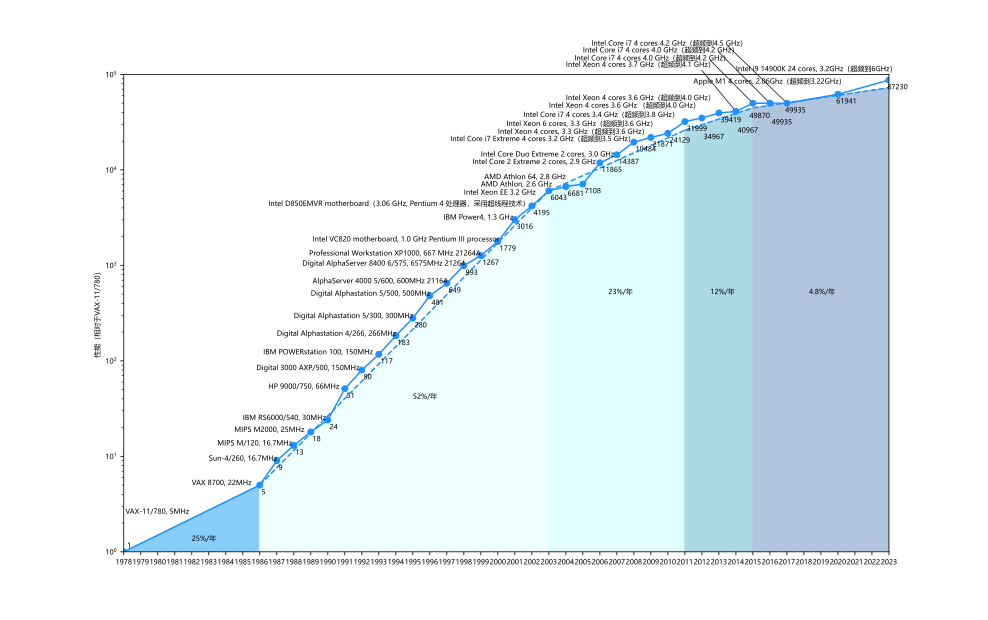

# 并行编程导论

!!! info "Question"
    If you were plowing a field, which would you rather use? Two strong oxen or 1024 chickens?

    *Seymour Cray*

尽管我们要介绍的是并行编程，但是不得不说的是，程序员往往都是不愿意并行编程的。要知道，我们今天所熟知的MPI、OpenMP和CUDA编程都是20世纪90年代以后才逐渐发展起来，并在最近的20年逐渐走向热门的。

究其原因，是因为计算机性能的发展不再能够满足人们的需要。我们可以看到，在处理器遇到功耗墙（2003年前后）后，人们意识到不能通过一味提高处理器主频来获得性能的持续增长。



图：40年来处理器性能进步示意图。1978-2018年的数据由Patterson和Hennessy（2017）给出，之后几年的数据是综合了Geekbench5和其他几个基准测试给出的大致值（具体的细节在这里我们不作过多描述）。2023年的数据经过估算，将其转化到4个核总的的平均表现上得出。

所以，从单核转向多核，是人们迫不得已的选择。当前面临的情况是，处理器性能提升的速度放缓，根据Hennessy和Patterson等人的测算（2017），大约是每20年翻一番，而不是1986年到2003年期间的每1.5年翻一番。现实情况是

- 摩尔定律放缓，登纳德缩放定律终结，晶体管的工艺不再在短时间内持续大幅进展；

- 微处理器的功耗预算不变（在桌面计算机和个人移动设备上，人们的功耗预期甚至在下降）；

- 使用多个高能效的处理器代替单个功能强大但是功耗更大的处理器——然而这并不是没有代价的，这意味着掌握并行编程已经成为了程序员应当具备的十分重要的能力，我们所说的并行编程，应当说涵盖了指令级并行、数据级并行、线程（和进程）级并行和请求级并行（这在构建高并发的互联网应用中十分常见）。

最后，在本章将要结束的时候，我们会看到多重处理已经达到了Amdahl定律的上限。为了在能耗、成本、性能的三角中取得平衡，唯一的途径就是专用。我们在其他章节还会介绍Tensor Core的体系结构，它就是专用处理器的典型代表，能够大幅提升矩阵乘法的性能。

## 并行编程的基本概念

我们来看一个最简单的例子。

=== "C语言"
    ```c
    #include <stdio.h>
    int main(){
        printf("Hello, world!\n");
        return 0;
    }
    ```

使用gcc可以很容易地将这段代码编译为可执行文件。像这样的文件在现代操作系统上运行时，操作系统会提供一种假象，好像系统上只有这个程序在运行。程序看上去是独占地使用处理器、主存和I/O设备；处理器看上去就像是在一条接一条地执行程序中的指令——这个假象是通过**进程**（process）这一抽象概念来实现的，而并发运行则是指不同进程之间的指令在处理器上交错运行。

对于一个单处理器的系统，在任何时刻它都只能处理一个进程的代码。于是，需要依靠操作系统来将控制权从一个进程切换到另一个进程。在切换之前，操作系统需要保存这个进程的全部状态（被称作**上下文**，context），当控制权切换回先前的程序时，进程就会从它上次停止的地方继续运行。

在现代的计算机系统中，一个进程实际上可以由多个更轻量级的单元组成，每一个单元被称为**线程**（thread）。每一个线程都运行在进程的上下文中，并共享同样的代码和全局数据。

既然希望并发编程，那我们当然需要不同的执行单元之间存在某种能够相互协同的机制。在曾经的某段时间里，人们倾向于将计算机系统设计为所有的存储器都使用相同的编址，所有的处理器都通过片间互联网络访问到存储器，执行单元通过向某个特定的内存地址写入或读出数据，可以实现与其他执行单元隐式的信息交换。Pthread和OpenMP正是采用了这样的思路，不同的线程共享了相同的地址空间，通过对共享变量的读写，不同的线程间得以实现通信。

当需要协同的执行单元分布在不同的计算机上（甚至是网络中的计算机），上面共享内存的方法就爱莫能助了。然而，这些执行单元可以通过网络在不同的主机之间传递消息。流行的消息传递库MPI（Message Passing Interface）提供了一组丰富的进程间通信原语，通过显式地在不同进程间发送或接收消息，来实现进程间的通信。特别地，这些进程还可以分布在遥远的世界角落中，通过网络可以完成分布式计算。

??? info "SETI@home：分布式计算分析天文观测结果"
    SETI@home是近几十年来影响最大的分布式计算应用。它从1999年5月17日开始运行，全世界的计算机都可以通过下载一个软件，参与到计算和分析射电望远镜的观测结果的工作中。

## 并行编程的一般方法

在这里我们介绍经典的Foster设计方法，它由lan Foster提出，并被广广泛应用到了并行程序的设计中。Foster方法由四部分构成：**划分**（partition）、**通信**（communication）、**整合**（agglomeration）和**映射**（mapping）。

划分阶段，我们需要将工作分解为若干小的部分。一方面，我们可以对数据进行划分，例如将计算$n$个粒子的运动参数划分为对$\frac{n}{2}$个粒子运动参数的计算。另一方面，我们可以对操作进行划分，这在大规模神经网络训练上很常见，可能一张加速卡只负责某些层的计算，然后将计算结果作为输入通过网络传递给下游的加速卡。

??? warning "什么是好的划分"
    好的划分通常具有这些特征：尽可能减少由于划分带来的额外开销；原任务数是关于划分数量的某个函数；对于各个划分，它们的任务量应当是大致相同的。在之后我们会看到好的划分在负载均衡和提升总体性能表现上的优越性。

通信阶段主要包含局部通信和全局通信。通信往往会带来额外的开销，例如当进程A需要的数据还没有被进程B计算完时，进程A将不得不等待。通信的功能一方面是为了交换数据，另一方面也能起到同步的作用。

??? warning "通信是有代价的吗"
    在一个并行程序中，通信的开销往往是很昂贵的（尤其是在分布式计算中，数据包不得不沿着长长的链路在两台主机间交互）。因此，一个性质良好的程序应当使得计算单元尽可能少地进行通信，尤其是要避免大量的全局通信出现。执行单元还应当可以独立地并行进行通信，为进行并行的计算提供便利。

整合的含义是研究划分好的子任务可能被合并的可能性，并加以合并。例如，当任务A所需要的数据仅仅来自任务B，而任务B的功能仅仅是产生这个数据时，我们完全可以将任务A和任务B合并成一个较大的任务，这样就能够减少通信带来的开销。

映射阶段，我们将任务映射到具体的处理器。在这个阶段，我们关注任务的负载均衡，并期望尽可能减少处理器之间的通信。

## 学习路径

首先，为了在支持并行计算的系统（往往是多核系统）上进行编程，我们首先需要了解对我们来说有用的有关系统的特征；然后，为了简化这个系统，我们将使用流行的并行编程API（application program interface），包括MPI（message passing interface）、OpenMP和CUDA（在其他大章节中涉及）。在每一个环节上，我们都会通过几个经典的例子来了解如何使用这些API来编程，主要包括

- 圆周率计算
- 矩阵乘法
- 动力学参量计算

它们都来自于现代计算的实际需要。当然了，在编程实践中，我们将会碰到许多有意思的话题，例如我们会写出看上去是并行但实际上比串行程序将运行得更慢的代码。因此，除了计算，我们还会关注若干基本的性能的分析、评价和优化，我们相信对程序本身的分析和写出正确的程序同等重要。

或许你对上面的概念都还有些许陌生，但是没关系，我们暂时还不需要十分关心这些术语的确切含义，而是会在之后的学习中渐渐理解它们。现在，我们就要开始通过一些实例具体地着手并行编程了。你可以查看其他章节进行进一步的学习。